# Prevendo a rotatividade de clientes com Marchine-Learning

# 1. Introdução
   
Os cientistas de dados do BigMart coletaram dados de vendas de 2013 para 1.559 produtos em 10 lojas em diferentes cidades. Além disso, foram definidos alguns atributos de cada produto e loja. O objetivo é construir um modelo preditivo e prever as vendas de cada produto em um determinado ponto de venda. Usando este modelo, o BigMart tentará entender as propriedades dos produtos e pontos de venda que desempenham um papel fundamental no aumento das vendas. Observe que os dados podem ter valores ausentes, pois algumas lojas podem não relatar todos os dados devido a falhas técnicas. Portanto, será necessário tratá-los adequadamente. Desse modo, a partir do conjunto de dados extraidos da plataforma [Kaggle](https://www.kaggle.com/datasets/shivan118/big-mart-sales-prediction-datasets), este projeto tem a finalidade de criar modelos preditivos para prever a rotatividade de clientes numa determinada empresa.

# 2. Objetivo

Construir um modelo de predição vendas.

# 3. Justificativa
   
Esse projeto possui um problema de negócio que envolve previsão de vendas. Esse é um tipo de problema muito importante para as empresas, visto que uma vez que elas possuem um modelo que consegue prever as vendas da empresa apresentando uma boa performance, elas podem antecipar os valores futuros que serão recebidos para o presente momento. Dessa maneira, se por exemplo, imaginemos que o gerente de uma determinada empresa quer fazê-la crescer, expandindo-a. Acontece que o crescimento de uma empresa passa pela contratação de pessoas, adquisição de novos equipamentos e ferramentas, dentre outros. Sendo assim, se a empresa tem uma previsão/expectativa do quanto de faturamento que ela irá ter nos próximos meses/anos, ela já consegue, por exemplo, tomar um empréstimo no banco para investir agora e fazer a empresa crescer no presente momento sem ter que precisar esperar por um dinheiro futuro. Dessa maneira, usando este modelo, o BigMart tentará entender as propriedades dos produtos e pontos de venda que desempenham um papel fundamental no aumento das vendas.

# 4. Metodologia
Este é um projeto de data sciense and analyts, que envolve a utilização de modelos de machine leaning com objetivo de prever as vendas de cada produto em um determinado ponto de venda do Big Mart. Para alcançar o objetivo proposto, o primeiro passo é importar as bibliotecas necessárias para construção do projeto. Em seguida, é feita a coleta dos dados. Logo após, uma análise dos dados inicial, com intuito de conhecer os dados e verificar possíveis inconsistências, tais como valores faltantes, valores inconsistentes, valores duplicados, presença de outliets, dentre outros. Depois, é feito a limpeza e o tratamento dos dados. Em seguida é realizado análise exploratória dos dados, com a finalidade de obter insigts para o time de negócios. Segue se a essa etapa a preparação dos dados para aprendizagem dos modelos de Marchine Learning. Com os dados já preparados é feito a aplicação dos Modelos de Machine Learning. Após isso, esses modelos passa por uma avaliação, em que é escolhidos os modelos que serão colocados em produção. Por fim, a última etapa é focada em traduzir o desempenho dos modelos escolhidos para métricas de negócios. Desse modo, o projeto foi dividido da seguinte maneira:

#### 1. Introdução (Entendimento do Negócio)
- Tem por objetivo identifiar as demandas do time de negócio   
#### 2. Objetivo
- A partir da idenrificação das demandas do time de negócios traçar o objetivo do projeto.
#### 3. Justificativa
- O porque da realização do projeto.
#### 4. Metodologia
- Como será feito
#### 5.  Importação das bibliotecas utilizadas ao longo de todo o projeto
- Quais bibliotecas necessárias para rodar o projeto em python
#### 6.  Coleta de dados
- Onde se encontra os dados
#### 7. Verificando inconsistências nos dados
- Como os dados se apresentam
#### 8. Limpeza e Tratamento dos Dados
- Deixando os dados limpos 
#### 9. Análise Exploratória dos Dados: Obtendo insigts para o time de negócios
- Analisando o comportamento das variáveis para obter insigts time de negócios.
#### 10. Preparação dos dados para aprendizagem dos modelos de Marchine Learning
- Deixando os dados prontos para rodar os modelos de marchine learning.
#### 11. Aplicando os Modelos de Machine Learning
- Aplicando os modelos de marchine na base a base de dados.
#### 12. Avaliação dos algoritmos
- Avaliando o desempenho dos modelos e escolhendo o modelo que será colocado em produção.
#### 13. Traduzindo desempenho dos modelos escolhidos para métricas de negócios
- Traduzir o desempenho do modelo para métricas de negócios.

# 5. Coleta dos dados

Os dados foram extraidos da plataforma [Kaggle](https://www.kaggle.com/datasets/shivan118/big-mart-sales-prediction-datasets) Foi feio o downloard do arquivo em csv e importado para o jupyter notebook utilizando a biblioteca pandas. Após isso, foi feito um cópia desses dados.

 

# 6. Verificando inconsistências nos dados
## - Tamanhos dos dados
 * O conjunto de dados possui 8523 linhas e 12 colunas.
## - Tipo dos dados
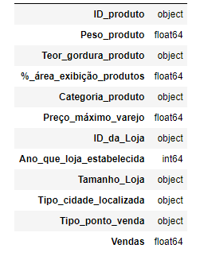
## - Verificando existência de valores nulos
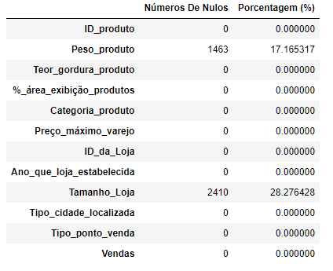
* Como podemos observar, a coluna "Peso do produto" possui 1463 valore nulos.
* Já a coluna "Tamanho da loja em termos de área coberta" possui 2410.
* Perceba que os valores nulos representam aproximadamente 17,17% dos dados da coluna "Peso do produto".
* E aproximadamente 28,28% dos dados da coluna "Tamanho da loja em termos de área coberta.
## - Verificando existência de valores inconsistentes
* Na coluna Teor de gordura do produto consta as seguintes categorias: Low Fat (Baixo teor de gordura), Regular, LF (baixo teor de gordura), reg (Regular) e low fat (Baixo teor de gordura). Só que existem categorias repetidas, mas que foi escritas de forma diferentes. Sendo assim, Low Fat, LF e low fat se refere a uma única categoria que é baixo teor de gordura, enquanto que Regular e Reg se refere somente a Regular.

* Na coluna % da área total de exibição de todos os produtos em uma loja alocada para o determinado produto foi identificado algumas linhas com 0. Acontece que não existe produtos com área de exibição 0.
## - Verificando a existência de dados duplicados
* Não há valores duplicados.
## - Conclusões
Foi dentificado os seguintes problemas:

* Na coluna Peso do produto foi identificado 1463 valores nulos e na coluna Tamanho da loja em termos de área coberta 2410.

* Na coluna Teor de gordura do produto consta as seguintes categorias:  Low Fat (Baixo teor de gordura), Regular, LF (baixo teor de gordura), reg (Regular) e low fat (Baixo teor de gordura). Só que existem categorias repetidas, mas que foi escritas de forma diferentes. Sendo assim, Low Fat, LF e low fat se refere a uma única categoria que é baixo teor de gordura, enquanto que Regular e Reg se refere somente a Regular.

* Na coluna % da área total de exibição de todos os produtos em uma loja alocada para o determinado produto foi identificado algumas linhas com 0. Acontece que não existe produtos com área de exibição 0.

* Não há valores duplicados.

# 7. Limpeza e Tratamento dos Dados

## - Tratando os valores faltantes
* Foi feita a exclusão dos valores faltantes.
 ## - Tratando os valores inconsistentes
* Substituiu os zeros da coluna % da área de exibição dos produtos pela mediana.
* Substituindo as categorias [low fat] e [LF] por "Low Fat" e [reg] por "Regular"
## - Detecção de outliers  com o Boxplot
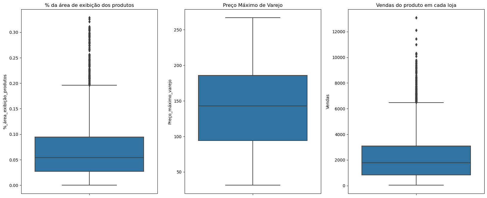 
## - Detecção de outliers com o algoritmo KNN
- Lista completa dos outliers para ser enviada para o setor responsável.
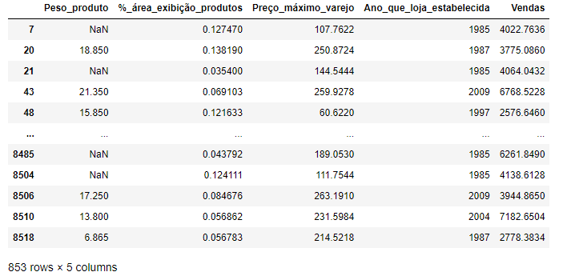

* Foi criada uma lista om os IDs dos registros que foram considerados outliers para ser enviada para o setor responsável para verificar o motivo desses outliers.

# 8. Análise Exploratória dos Dados: Obtendo insigts para o time de negócios
## 8.1 Hipótese de Negócios
- Mapa Mental de Hipóteses
  
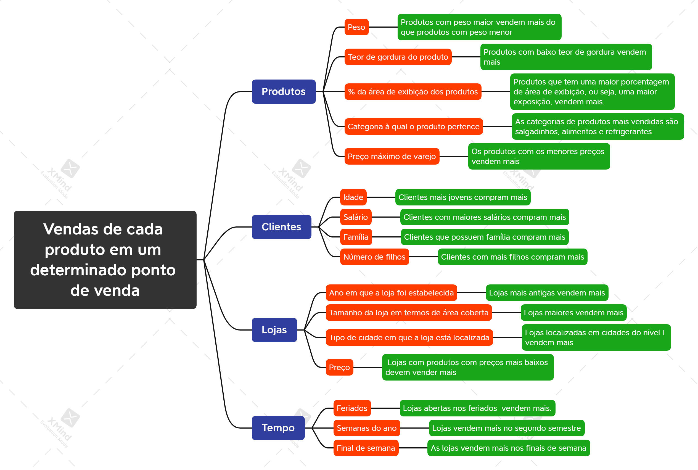

#### - Lista de Hipóteses selecionadas:
*****1*****. Produtos com peso maior vendem mais do que produtos com peso menor.

*****2*****. Produtos com baixo teor de gordura vendem mais.

*****3.***** Produtos que tem uma maior porcentagem de área de exibição, ou seja, uma maior exposição, vendem mais.

*****4.***** As categorias de produtos mais vendidas são salgadinhos, alimentos e refrigerantes.

*****5.***** Os produtos com os menores preços vendem mais.

*****6.***** Lojas mais antigas vendem mais.

*****7.***** Lojas maiores vendem mais.

*****8.***** Lojas localizadas em cidades do nível 1 vendem mais.
## 8.2  Análise Univariada
### 8.2.1 Distribuição da variável resposta
### -  Plotando um gráfico de distribuição normal
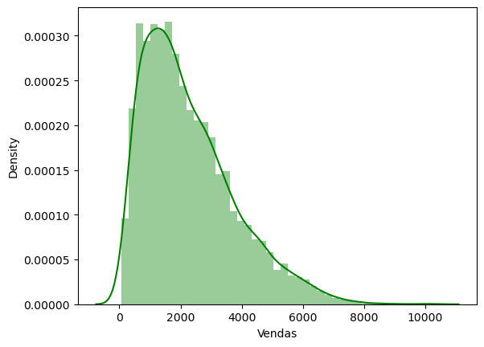
### - Executando o teste de Shapiro-Wilk para ver se a distribuição está normal
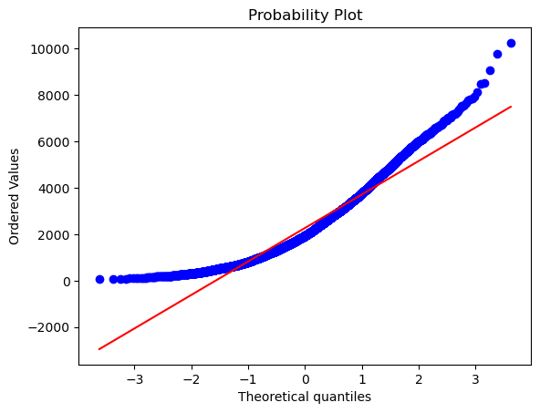

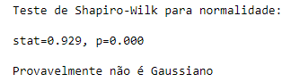

* A distribuição da variável resposta não é normal.

### 8.2.2 Separando as variáveis categóricas e númericas
#### - Variáveis númericas
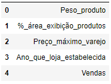

#### - Variáveis categóricas
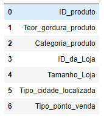

### 8.2.3 Analisando os atributos númericos
### -  Estatísticas Descritivas
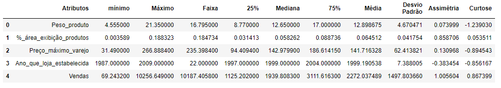

### -  Distribuição das variáveis numéricas
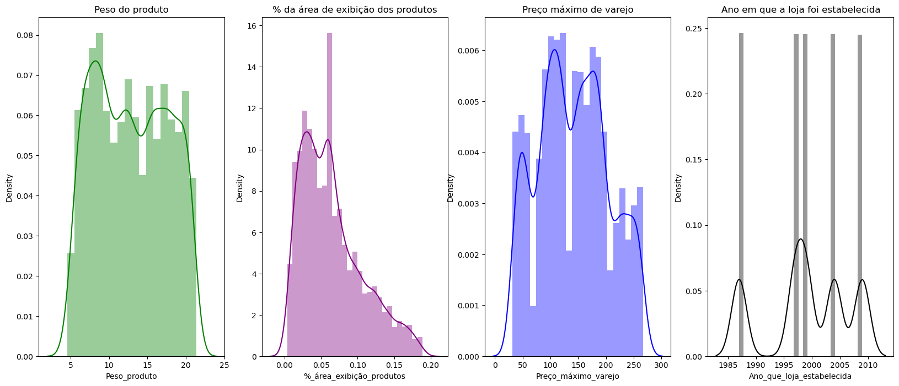
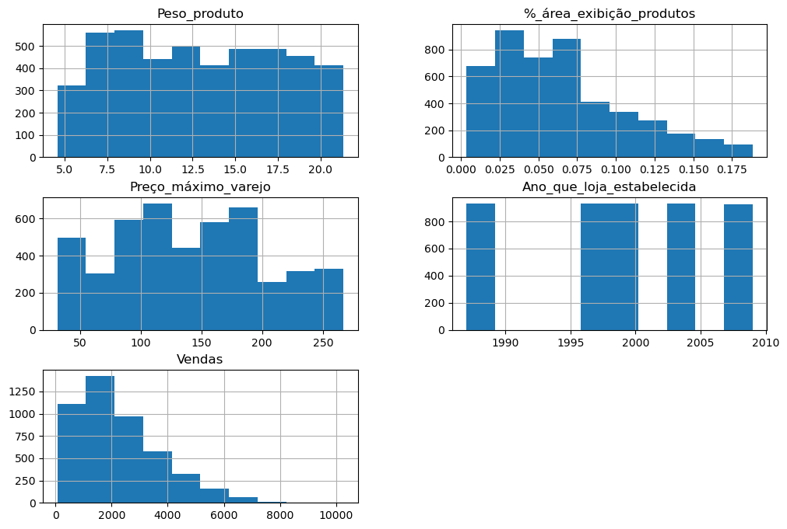

## 8.3 Análise Bivariada - Validação de Hipóteses

### - H1: Produtos com peso maior vendem mais do que produtos com peso menor.
######  Quantidade de Vendas de acordo com o Peso dos produtos

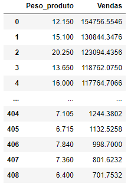

**FALSO**: Não necessariamente. Os produtos com peso 12.150 foram os venderam mais, isto é, 154756.5546, e esse não é o maior peso.

### - H2: Produtos com baixo teor de gordura vendem mais.
###### Quantidade de produtos vendidos de acordo com o teor de gordura
                                                    
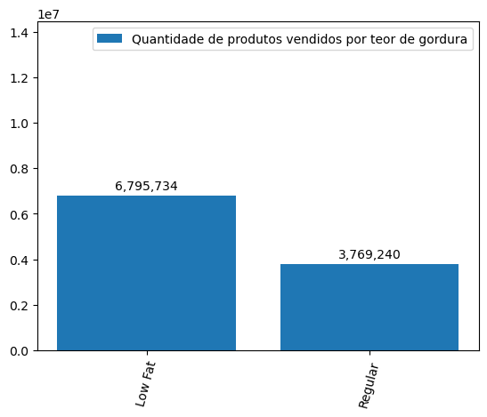

*****VERDADEIRO*****: Foram vendidos 6,795,734 produtos com baixo teor de gordura e 3,769,240 com teor de gordura regular.

### - H3: Produtos que tem uma maior porcentagem de área de exibição, ou seja, uma maior exposição, vendem mais.
###### Quantidade de vendas de acordo com a % da área de exibição dos produtos dos produtos
                                                  
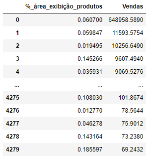

*****FALSO*****: Perceba que foram vendidos 648958.5890 (maior quantidade de vendas), os quais tinham uma área de exibição de 0.060700%. Contudo, essa não é a maior porcentagem de área de exibição. Tiveram produtos com porcentagem de área de exibição maior, porém as vendas não foram maior.

### H4: As categorias de produtos mais vendidas são salgadinhos, alimentos e refrigerantes. 
###### Quantidade de vendas por categoria dos produtos

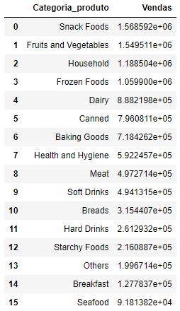

*****FALSO*****: As categorias de produtos mais vendidos foram salgadinhos em primeiro lugar, seguido de Frutas e vegetais, produtos domésticos, alimentos congelados e Laticínio.

### - H5:  Os produtos com os menores preços vendem mais.  
###### Quantidade de produtos vendidos de acordo com o preço
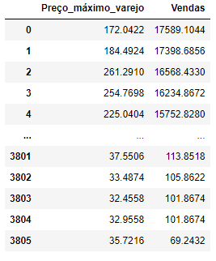

*****FALSO*****: Não necessariamente. Por exemplo, a maior quantidade de produtos vendidos, isto é, 17589.1044 produtos, possuem o preço de 172.0422 e esse não é o menor preço.

### - H6:  Lojas mais antigas vendem mais.
###### Quantidade de produtos vendidos por ano de estabelecimento da loja

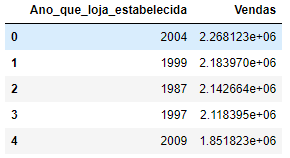

*****FALSO*****: A maior quantidade de produtos vendidos pertencem as lojas estabelecidas no ano de 2004. 

### - H7:  Lojas maiores vendem mais. 
###### Quantidade de produtos vendidos por tamanho da loja em termos de área coberta

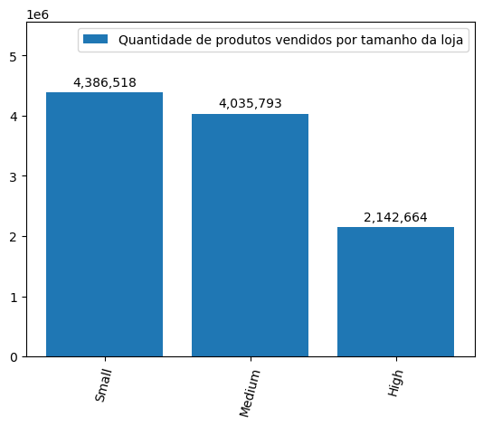

*****FALSO*****: A maior quantidade de vendas, isto é, 4,386,518 pertencem as lojas Small(pequenas), seguido das lojas medium (médias) com 4,035,793 e lojas maiores com 2,142,664.

### - H8: Lojas localizadas em cidades do nível 1 vendem mais. 
###### Quantidade de vendas por tipo de cidade
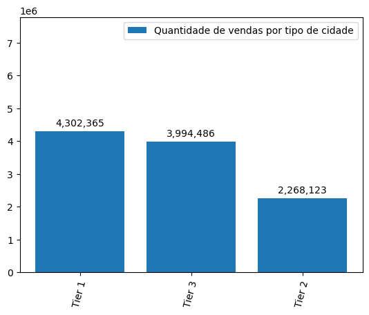

*****VERDADEIRO*****: O total de vendas de todas as lojas localizadas em cidade do nível 1 foi de 4,302,365.
## 8.4 Análise Multivariada
### - Atributos numéricos

### - Correlação entre as variáveis númericas
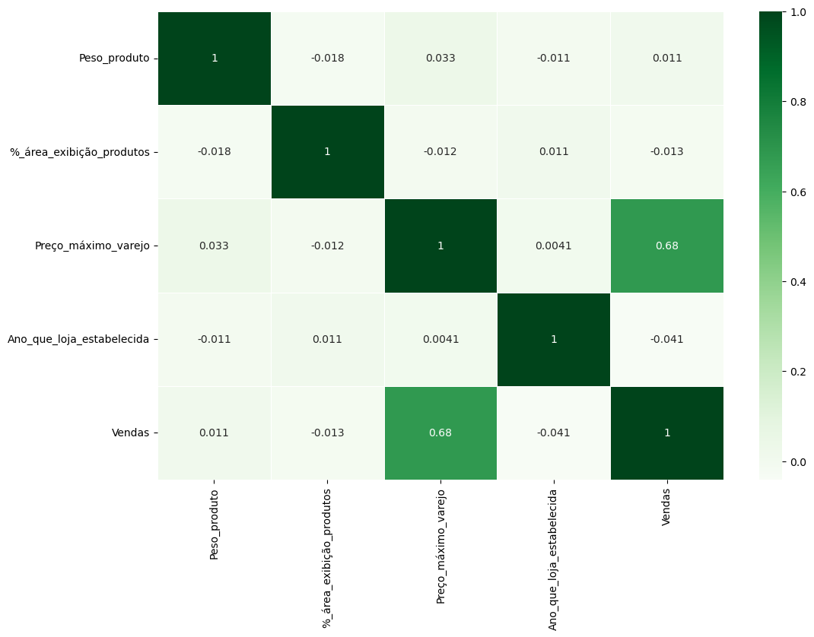

### -  Atributos categóricos

### -  Correlação entre as variáveis categóricas
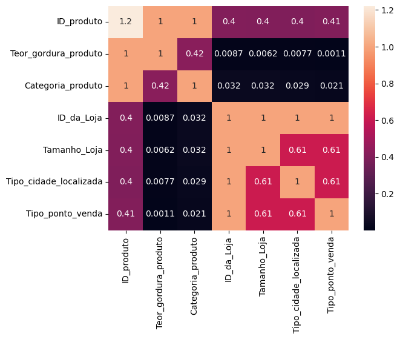

# 9. Preparação dos dados para aprendizagem dos modelos de Marchine Learning

## 9.1 Divisão entre atributos/previsores e classe
### - Visualizando as colunas
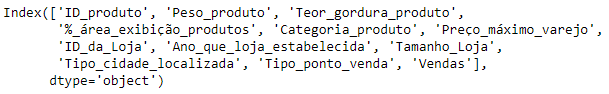

### - Separando as variaveis independentes
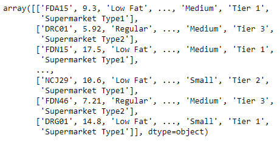

###  Separando a variavel dependente
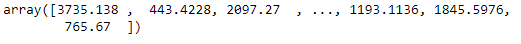

## 9.2 Tratamento dos atributos categóricos (LabelEncoder, OneHotEncoder)

### - LabelEncoder
* Transforma os dados categóricos em dados númericos.
###### -  Visualizando os atributos numéricos após a aplicação do LabelEncoder
 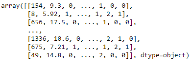
 
### - OneHotEncoder
###### - Visualizando registros categóricos trasnformados
 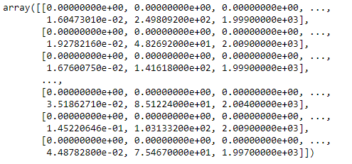
 
## 9.3 Escalonamento dos Valores (padronizando utilizando o StandardScaler)
* Escalonamento de valores é deixá-los na mesma escala.
###### - Visualizando atributos numéricos já com os dados na mesma escala
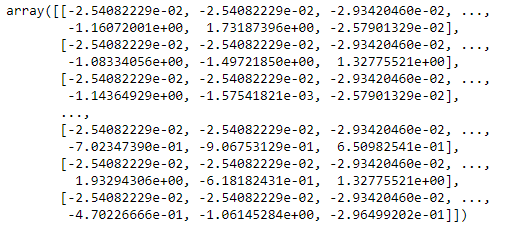

## 9.4 Divisão da base em treinamento e teste
* Colocou somente 15% dos dados para testar e o restante, 85%, para treinar os algoritmos.
* Temos 3952 registros e 1570 colunas para os atributos/caracteristicas e 3952 registros para a classe.
* Temos 3952 registros para treinar e 698 para testar.
  
## 9.5 Salvando as variáveis com o pickle com os dados já tratados e divididos
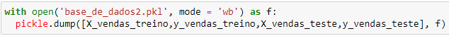
* Após a preparação dos dados, eles são salvos.

# 10. Aplicando os Modelos de Machine Learning
**Algoritmos utilizados**

**1**. Regressão Linear

**2**. Modelo Regularizado de Regressão Linear - Lasso

**3**.  XGBRegressor

**4**. SVM

**5**. RandomForestRegressor

# 11. Avaliação dos algoritmos
## 11.1 Performance dos Algoritmos
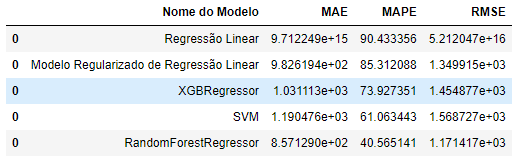

## 11.2 Ajuste dos parâmetros com RandomizedSearchCV e Validação Cruzada
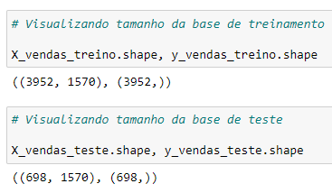
* Ou seja, anteriormente estávamos trabalhando com 3952 registros para treinar o algoritmo e 698 para testar. Tínhamos isso quando estávamos trabalhando com a divisão das bases de dados, isto é, uma parte dos dados para treinar e a outra parte para testar.

* Contudo, na validação cruzada nós utilizamos a base de dados inteira, não utilizamos essa divisão, pois durante o processo de validação cruzada o próprio algoritmo vai fazer as quebras/divisões da base de dados. Então o que vamos precisar fazer agora é concatenar essas duas variáveis (treinamento e teste) para termos a base de dados completa.

### 11.2.2 Juntando as bases de treino e teste
(4650, 1570)
* Perceba que agora temos os 4650 registros na mesma variável.

### 11.2.3 Aplicação do RandomizedSearchCV para descobrirmos os melhores parâmetros para cada um dos algoritmos
> * Existem três estratégias para encontrar o conjunto de parâmetros que maximiza a aprendizagem do modelo: 

**1**. **Random Search**: Define os valores para cada um dos parâmetros de forma aleatória. Uma das vantagens é que ele mais rápido se comparado com as outras técnicas. Porém, dentre as desvantagens está o fato de que ele acaba selecionando o mesmo conjunto de valores que já foi testado em outra interação. Além disso, uma outra desvantagem é que ele pode nunca conseguir encontrar o melhor conjunto de valores que maximiza a aprendizagem do modelo, porque como a pesquisa é aleatória pode ser que por causa dessa aleatoriedade ele não encontre o melhor conjunto de parâmetros.

**2**. **Grid Search**: Define todas as combinações possíveis de valores que os parâmetros podem assumir. A vantagem é que ele realmente consegue encontrar o melhor conjunto de valores para cada um dos parâmetros que maximiza o modelo e, caso ele não encontre, fica próximo disso. Contudo, pelo fato de ele buscar fazer todas as combinações possíveis, demora muito tempo.

**3**. **Bayesian**: Define os valores dos parâmetros seguindo a teoria de Bayes. Ele busca encontrar o melhor conjunto de parâmetros baseado na aprendizagem anterior. Ele não faz nada aleatório como o Random Search e também não testa todas as possibilidades como o Grid Search, mas busca encontrar o melhor conjunto baseado na aprendizagem anterior. Ele é mais rápido do que o Grid Search, porém é mais lento do que o Random Search. 

* Por ser mais rápido que os demais, tentei utilizar o Random Search, porém mesmo rodando o códigos tanto pelo jupyter notebook na minha máquina pessoal quanto pelo google colab, foi demorado e não saiu o resultado. Por isso, decidir prosseguir com a implementação da validação cruzada sem fazer esse ajuste de parâmetros.

### 11.2.4 Visualização dos resultados após a implementação da Validação Cruzada
######  Resultados com a divisão dos dados em treino e teste
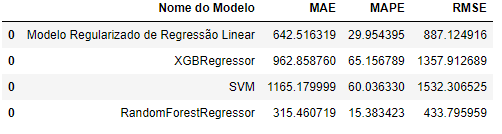

### 11.2.5 Comparando resultados com a divisão treino e teste e com a implementação da validação cruzada
######  Resultados com a implementação da validação cruzada
                                                     

# 12.Traduzindo desempenho dos modelos escolhidos para métricas de negócios
## 12.1 Prevendo as vendas com o modelo escolhido
### 12.1.1 Prevendo as vendas por loja com o RandomForestRegressor
#### - Fazendo as previsões
 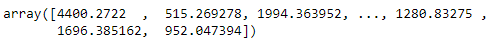

 #### - Performance
  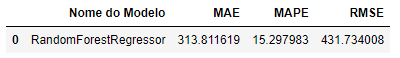

 #### - Total das vendas previstas
  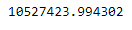

#### Total de vendas reais
  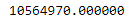

## 12.2 Impacto do modelo sobre o negócio
Existem duas maneiras de verificar o impacto de um modelo preditivo sobre o negócio, ou seja, o quanto esse modelo trará de retorno para a empresa, seja retorno financeiro através do através do incremento de receitas ou redução de custos, seja pela diminição no tempo de determinado processo, contribuindo para o aumento da produtividade, dentre outros. 

**1**. **A primeira maneira é comparar a performance do modelo de marchine learning com as métricas já utilizadas pela empresa**:

* Existem empresas que possuem seus modelos de previsão seja de receitas, de vendas, de clientes, dentre outros, uma vez que as elas se baseiam em dados futuros para planejar sua operação. Sendo assim, uma alternativa é comparar a performance do modelo já utilizado na empresa com o modelo de marchine learning e, assim, constatar se com o modelo de marchine learning há um menor erro nas previsões em comparação com o modelo existente na empresa, se a acurácia é melhor, se com esse modelo a empresa pode evitar desperdícios etc.

**2**. **Uma outra maneira é através do próprio modelo de marchine learning verificar o incremento que o modelo trás para o negócio, seja incremento de receita, redução de custo, redução de tempo, perda de clientes, dentre outros.**:

* O modelo que teve o melhor desepenho nesse projeto foi o Random Forest com erro de 15,29%. Sua previsão de vendas é bem próxima dos dados reais. Assim, com a previsão do quanto de vendas a empresa terá no futuro e com os preços dos produtos, é possível verificar o quanto de receita a empresa terá caso coloque o modelo em produção, levando-se em consideração que esse modelo possui um erro de 15,29%. Esse erro mostra o quão longe a predição do modelo está em torno dos valores reais.

